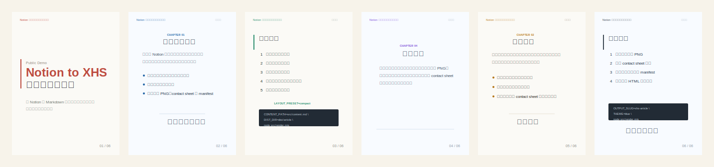

# Notion to Xiaohongshu Images Skill

Public Codex skill for turning Notion pages, Notion-exported Markdown, or Markdown drafts into polished Xiaohongshu/XHS multi-image card posts.

## Demo Preview



The preview combines six sample cards generated from the renderer, showing cover, text, list, quote, and code layouts across several visual styles.

## What It Helps With

- Convert long-form Notion or Markdown content into `1080x1440` logical cards exported as `2160x2880` PNG files.
- Preserve article structure, headings, lists, quotes, images, code fences, inline code, bold text, and highlights.
- Decide whether content should fit into one XHS post or be routed into a linked two-post series.
- Render covers, headers, footers, page numbers, rounded image assets, syntax-highlighted code blocks, contact sheets, and manifests.
- Customize themes, accents, cover copy, output paths, slugs, layout density, and optional author byline through environment variables.

## Skill Layout

```text
skills/notion-to-xhs-images/
  SKILL.md
  agents/openai.yaml
  assets/render-template.mjs
  references/rendering-guidelines.md
```

`SKILL.md` contains the core agent workflow. The renderer template lives in `assets/` so an agent can copy it into a working project and adapt it without loading every implementation detail into context.

## Requirements

- Node.js 20+
- `playwright`
- `sharp`
- Chromium browser for Playwright

Typical setup inside a rendering workspace:

```bash
npm install playwright sharp
npx playwright install chromium
```

## Example Use

Ask your agent:

```text
Use $notion-to-xhs-images to convert this Notion page into polished Xiaohongshu image cards.
```

For Markdown input, place the content in `src/content.md`, copy `skills/notion-to-xhs-images/assets/render-template.mjs` to `src/render.mjs`, then render:

```bash
LAYOUT_PRESET=compact CONTENT_PATH=src/content.md DIST_DIR=dist/article OUTPUT_SLUG=xhs-article node src/render.mjs
```

Optional customization:

```bash
THEME=blue AUTHOR_NAME="Your Name" COVER_MAIN="Main Title" COVER_SUB="Subtitle" node src/render.mjs
PLAYWRIGHT_CHROMIUM_EXECUTABLE="/path/to/chrome" node src/render.mjs
```
